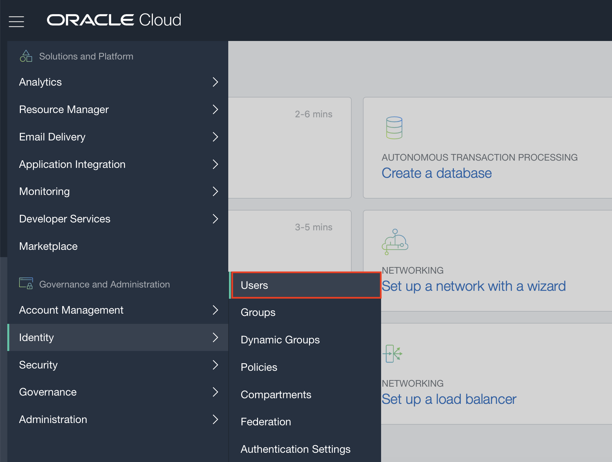
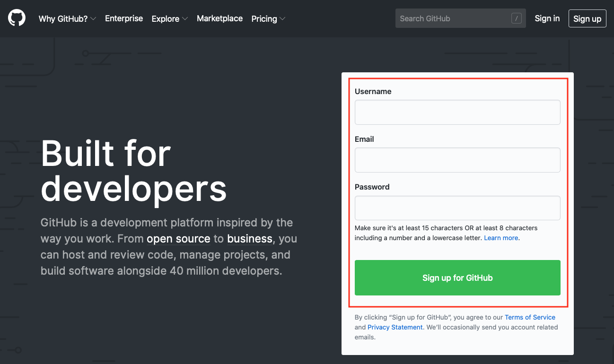
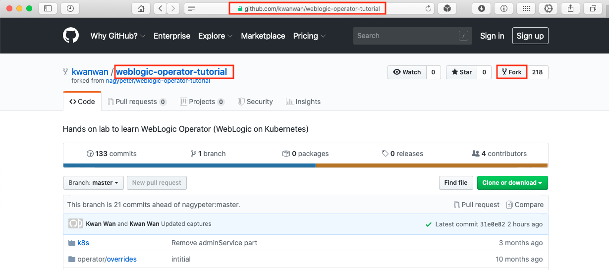
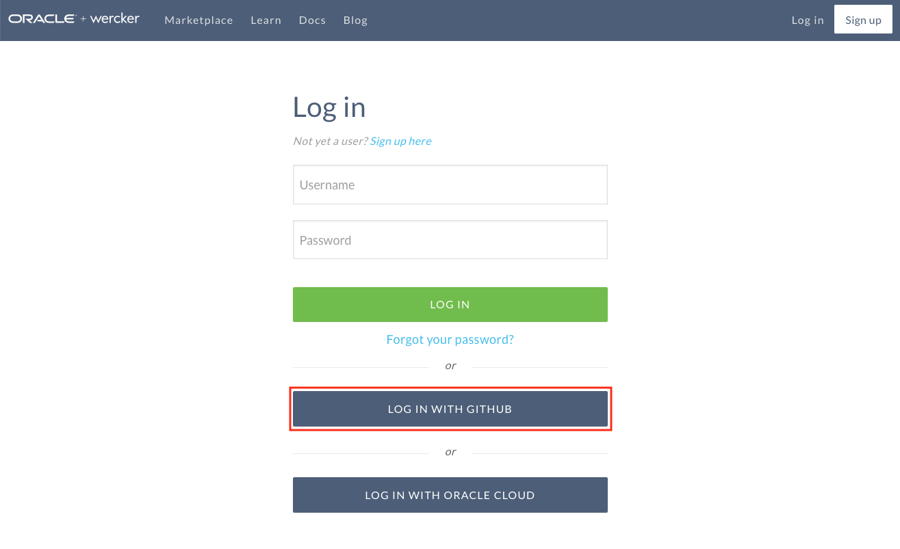
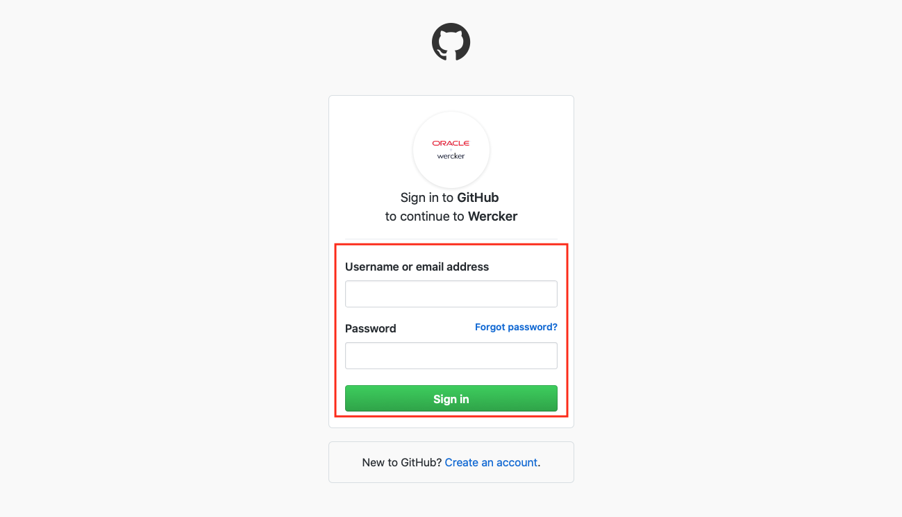

# Lab 1: Build WebLogic container image using Oracle Container Pipelines (Wercker) #

**Oracle Container Pipelines (Wercker)** is a Docker-Native CI/CD  Automation platform for Kubernetes & Microservice Deployments. Wercker is integrated with Docker containers, which package up application code and can be easily moved from server to server. Each build artifact can be a Docker container. The user can take the container from the Docker Hub or his private registry and build the code before shipping it. Its SaaS platform enables developers to test and deploy code often. They can push software updates incrementally as they are ready, rather than in bundled dumps. It makes it easier for coders to practice continuous integration, a software engineering practice in which each change a developer makes to the codebase is constantly tested in the process so that software doesn’t break when it goes live.

Oracle Container Pipelines is based on the concept of pipelines, which are automated workflows. Pipelines take pieces of code and automatically execute a series of steps upon that code.

This tutorial demonstrates how to create Oracle Container Pipelines application (CI/CD) to build/update custom WebLogic container image using official WebLogic image from Docker Store as base source.

The custom WebLogic Domain has the following components configured/deployed:

- Web Application to demonstrate WebLogic Operator features and application life cycle management
- JDBC DataSource to demonstrate WebLogic Operator override feature

The key components of Oracle Container Pipelines:

+ **Step** is self-contained bash script or compiled binary for accomplishing specific automation tasks.
+ **Pipelines** are a series of steps that are triggered on a git push or the completion of another pipeline.
+ **Workflows** are a set of chained and branched pipelines that allow you to form multi-stage, multi-branch complex CI/CD flows that take your project from code to production.
+ All pipelines execute inside a **Docker container** and every build artefact can be a Docker container.

## Prerequisites ##

- [Oracle Cloud Infrastructure](https://cloud.oracle.com/en_US/cloud-infrastructure) enabled account.
- [Docker](https://hub.docker.com/) account.
- [Github ](sign.up.github.md) account.
- [Oracle Container Pipeline](sign.up.wercker.md)

---

## Prepare Oracle Container Registry access ##

Before you create your build pipeline you need to get your Oracle Container Registry token. Token acts as password to container registry provided by Oracle Cloud Infrastructure.

Open your OCI (Oracle Cloud Infrastructure) Console. If necessary Sign in again using your Cloud Services link you got in email during the registration process. Remember on the dashboard you need to click the menu icon at the top left corner and select **Compute** on the left sliding menu.

Using the OCI console page click the user icon and select **User Settings**. On the left area of the User details page select the **Auth Tokens** item. Click the **Generate Token** to get a new token.

If the **User Settings** is grade out, you can your user setting by selecting **User** under **Identity** from the sliding menu on the left and locate your user ID.

Enter a description which allows you to easily identify the allocated token later. For example if you want to revoke then you have to find the proper token to delete. For example *ocir*.

Now **copy and store(!)** your generated token for later usage. You won't be able to retrieve this token again if you don't save it.

Click **Close**.

Since you are on the User details page please note the proper user name for later usage. You need to use this user name in order to login to OCI Registry for push and pull images.

## Accept Licence Agreement to use `store/oracle/weblogic:12.2.1.3` image from Docker Store ##

The Oracle WebLogic base image is stored in Docker Hub. If you have not used the base image [`store/oracle/weblogic:12.2.1.3`](https://store.docker.com/images/oracle-weblogic-server-12c) before, you will need to visit the [Docker Store web interface](https://store.docker.com/images/oracle-weblogic-server-12c) and accept the license agreement before the Docker Store will give you permission to pull that image.

Open [https://store.docker.com/images/oracle-weblogic-server-12c](https://store.docker.com/images/oracle-weblogic-server-12c) in a new browser and click **Log In**.

Enter your account details and click **Login**.

Click **Proceed to Checkout**.

Complete your contact information and accept agreements. Click **Get Content**.

Now you are ready to pull the image on Docker enabled host after authenticating yourself in Docker Hub using your Docker Hub credentials.

## Import WebLogic Operator Tutorial's source repository into your Github repository ##

In this step you will fork the tutorial's source repository. The source repository contains the demo application deployed on top of WebLogic server, configuration yaml to quickly create Oracle Container Pipelines(CI/CD) application to build custom WebLogic image and few additional Kubernetes configuration files to deploy the custom WebLogic image.

If you do not have a Github account then you need to sign up now.

Go to https://github.com

Enter your preferred username, password and email. **Click Sign up for GitHub**

**Otherwise**

Open the *https://github.com/kwanwan/weblogic-operator-tutorial* repository in your browser. Click the **Fork** button at the left top area. Sign in to github.com if necessary.

Wait until the fork process is complete.

## Create Oracle Container Pipelines Application to build custom WebLogic Docker container including demo application ##

If you do not have a Container Pipeline account then you need to sign up now.

Go to https://app.wercker.com

There are several ways to sign up a Container Pipeline account. **Click LOG IN WITH GITHUB** to sign in using your GitHub credentials.

Enter your GitHub Username and Password. **Click Sign in**

**Otherwise**

First create your Oracle Container Pipelines application. Oracle Container Pipelines acts as continuous integration tool which will produce WebLogic container image and uploads to Oracle Container Registry.

The following pipelines are predefined in the Oracle Container Pipelines configuration file ([wercker.yml](https://github.com/kwanwan/weblogic-operator-tutorial/blob/master/wercker.yml)):

- **build**: Default and mandatory pipeline to start the workflow. It builds the demo Web Application using Maven.
- **build-domain-in-home-image**: Pipeline which runs Docker build to create custom WebLogic container image. First time when no *latest* image available in repository it uses official WebLogic image from Docker Store as base image and runs WLST script to customise the image. Also copies the demo Web Application into the image and deploys using WLST. Once *latest* (tag) of the image is available in the repository then the workflow just builds the Web Application and update the *latest* image with the new application binaries. After the Docker build the pipeline produces a new image and pushes to the image repository. Thus every time when changes happen in the sources and committed to Github. The image tag will be the commit hash tag of the source changes  which triggered the new build process. Also the historically latest gets the *latest* tag as well.

[Sign in to Oracle Container Pipelines (former Wercker)](https://app.wercker.com/) and click **Create your first application** button or the **+** icon at the top right corner and select *Add Application*.

NOTE! If you need to sign up to Oracle Container Pipelines do it with your Github account. Click the **LOG IN WITH GITHUB** button and authorise Oracle Container Pipelines application for your Github account. You can revoke Oracle Container Pipelines's authorisation request anytime using your Github's profile settings.

Select the owner of the application. By default it is your Oracle Container Pipelines username, but it can be any organization where you belong to. Make sure the selected SCM is *GitHub*. Click **Next**.

Select *weblogic-operator-tutorial* repository what you imported previously. Click **Next**.

Leave the default repository access without SSH key. Click **Next**.

If you want you can make your application public if you want to share the application's status otherwise leave the default private settings. Click **Create**.

The repository already contains a necessary `wercker.yml` but before the execution provide the following key/value pairs as environment variables:

| Key | Value | Note |
|----------------|---------------------------------------------------------------------------|------------------------------------------------------------------------------------------------------------------------------------------------------------------|
| OCI_REGISTRY_USERNAME | your_cloud_username |  The username you took note of in user settings. e.g. oracleidentitycloudservice/john.p.smith@example.com |
| OCI_REGISTRY_PASSWORD | OCIR Auth Token | The Auth Token you generated previously |
| TENANCY | Name of your tenancy |
| REGION | The code of your home region. See the [documentation](https://docs.cloud.oracle.com/iaas/Content/Registry/Concepts/registryprerequisites.htm#Availab) to get your region code. | e.g. `fra` - stands for *eu-frankfurt-1*, `iad` for *us-ashburn-1*, `phx` for *us-phoenix-1* |
| DOCKER_USERNAME | Your Docker Hub username | Necessary to pull official WebLogic Server image from Docker Store |
| DOCKER_PASSWORD | Your Docker Hub password | Necessary to pull official WebLogic Server image from Docker Store |

To define these variables click **<>Environment** tab and enter keys and values. Remember that these values will be visible to anyone to whom you give access to the Oracle Container Pipelines application, therefore select **Protected** for any values that should remain hidden, including all passwords.

Make sure you click **Add** after completing every Key Value pair to save your settings.

Click the **Worklflow** tab and then **Add new pipeline** to enable pipeline defined in *wercker.yml*.

Enter the name of the pipeline and the "YML Pipeline Name" as *build-domain-in-home-image*. Please enter exactly this name - because this name is hardcoded in the *wercker.yml*. Click **Create**.

Click again the **Worklflow** tab to get back to the editor page. Click the + sign after the mandatory *build* pipeline.

Leave the default branch(es) configuration and select the *build-domain-in-home-image* pipeline.

Your workflow should be similar:

Go to the **Runs** tab and click ***trigger a build now*** link.

To get more details about the current step click on the pipeline.

When the workflow is completed the WebLogic image is available in your image repository.

Open the OCI console page and go to the container registry console to check.

In the registry you have to find a repository named like your Oracle Container Pipelines application (e.g. *weblogic-operator-tutorial*). If you open the repository for more details you  find two images. Technically the two images are the same, but got two tags. One of them is the git commit hash tag which is uniquely identify the image. The second *latest* tag applied because to have easier access to the historically latest release/image.

Now the WebLogic domain image is ready to deploy on Kubernetes using WebLogic Operator.

### You are now ready to move to the next lab - [Lab 2: Install WebLogic Operator](install.operator.md)  ###
