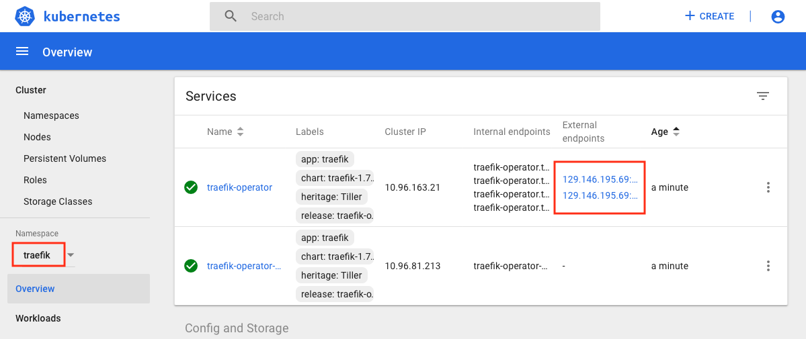

# Lab 3: Install and configure Traefik  #

The Oracle WebLogic Server Kubernetes Operator supports three load balancers: Traefik, Voyager, and Apache. Samples are provided in the [documentation](https://github.com/oracle/weblogic-kubernetes-operator/blob/2.0/kubernetes/samples/charts/README.md).

This tutorial demonstrates how to install the [Traefik](https://traefik.io/) ingress controller to provide load balancing for WebLogic clusters.

## Install the Traefik operator with a Helm chart ##

Change to your WebLogic Operator local Git repository folder.

    cd /u01/content/weblogic-kubernetes-operator/

To install the Traefik operator in the traefik namespace with the provided sample values:

    helm install stable/traefik \
    --name traefik-operator \
    --namespace traefik \
    --values kubernetes/samples/charts/traefik/values.yaml  \
    --set "kubernetes.namespaces={traefik}" \
    --set "serviceType=LoadBalancer"

The output should be similar:

     NAME:   traefik-operator
     LAST DEPLOYED: Mon Feb  4 10:58:41 2019
     NAMESPACE: traefik
     STATUS: DEPLOYED

     RESOURCES:
     ==> v1/ConfigMap
     NAME              DATA  AGE
     traefik-operator  1     24s

     ==> v1/ClusterRole
     NAME              AGE
     traefik-operator  23s

     ==> v1/Service
     NAME                        TYPE          CLUSTER-IP     EXTERNAL-IP     PORT(S)                     AGE
     traefik-operator-dashboard  ClusterIP     10.96.202.131  <none>          80/TCP                      23s
     traefik-operator            LoadBalancer  10.96.154.112  129.213.172.44  80:32396/TCP,443:32736/TCP  23s

     ==> v1beta1/Ingress
     NAME                        HOSTS                ADDRESS  PORTS  AGE
     traefik-operator-dashboard  traefik.example.com  80       23s

     ==> v1/Pod(related)
     NAME                               READY  STATUS   RESTARTS  AGE
     traefik-operator-8486f75bbd-q6pz5  1/1    Running  0         23s

     ==> v1/Secret
     NAME                           TYPE    DATA  AGE
     traefik-operator-default-cert  Opaque  2     24s

     ==> v1/ServiceAccount
     NAME              SECRETS  AGE
     traefik-operator  1        23s

     ==> v1/ClusterRoleBinding
     NAME              AGE
     traefik-operator  23s

     ==> v1/Deployment
     NAME              DESIRED  CURRENT  UP-TO-DATE  AVAILABLE  AGE
     traefik-operator  1        1        1           1          23s


     NOTES:

     1. Get Traefik's load balancer IP/hostname:

          NOTE: It may take a few minutes for this to become available.

          You can watch the status by running:

              $ kubectl get svc traefik-operator --namespace traefik -w

          Once 'EXTERNAL-IP' is no longer '<pending>':

              $ kubectl describe svc traefik-operator --namespace traefik | grep Ingress | awk '{print $3}'

     2. Configure DNS records corresponding to Kubernetes ingress resources to point to the load balancer IP/hostname found in step 1

The Traefik installation is basically done. Verify the Traefik (Loadbalancer) services:
```
kubectl get service -n traefik
NAME                         TYPE           CLUSTER-IP      EXTERNAL-IP      PORT(S)                      AGE
traefik-operator             LoadBalancer   10.96.154.112   129.213.172.44   80:32396/TCP,443:32736/TCP   2h
traefik-operator-dashboard   ClusterIP      10.96.202.131   <none>           80/TCP                       2h
```
Please note the EXTERNAL-IP of the *traefik-operator* service. This is the Public IP address of the Loadbalancer what you will use to open the WebLogic admin console and the sample application.

To print only the Public IP address you can execute this command:
```
$ kubectl describe svc traefik-operator --namespace traefik | grep Ingress | awk '{print $3}'
129.213.172.44
```

You may also verify the Public IP address by going to the Kubernetes Dashboard.



Verify the `helm` charts:

    $ helm list
    NAME            	REVISION	UPDATED                 	STATUS  	CHART         	NAMESPACE
    traefik-operator	1       	Mon Feb  4 10:58:41 2019	DEPLOYED	traefik-1.59.2	traefik  

You can also hit the Traefik's dashboard using `curl`. Use the EXTERNAL-IP address from the result above:

    curl -H 'host: traefik.example.com' http://EXTERNAL_IP_ADDRESS

For example:

    $ curl -H 'host: traefik.example.com' http://129.213.172.44
    <a href="/dashboard/">Found</a>.


### You are now ready to move to the next lab - [Lab 4: Deploy WebLogic Domain](deploy.weblogic_short.md) ###
