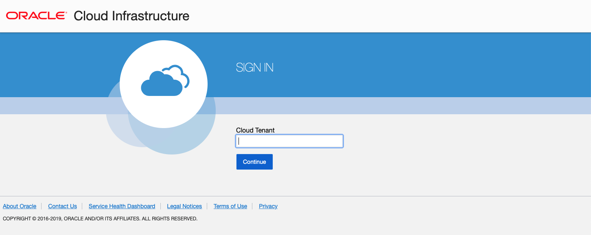
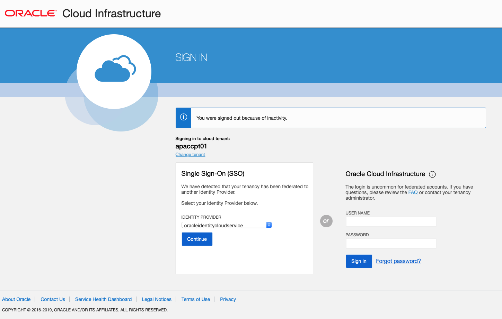
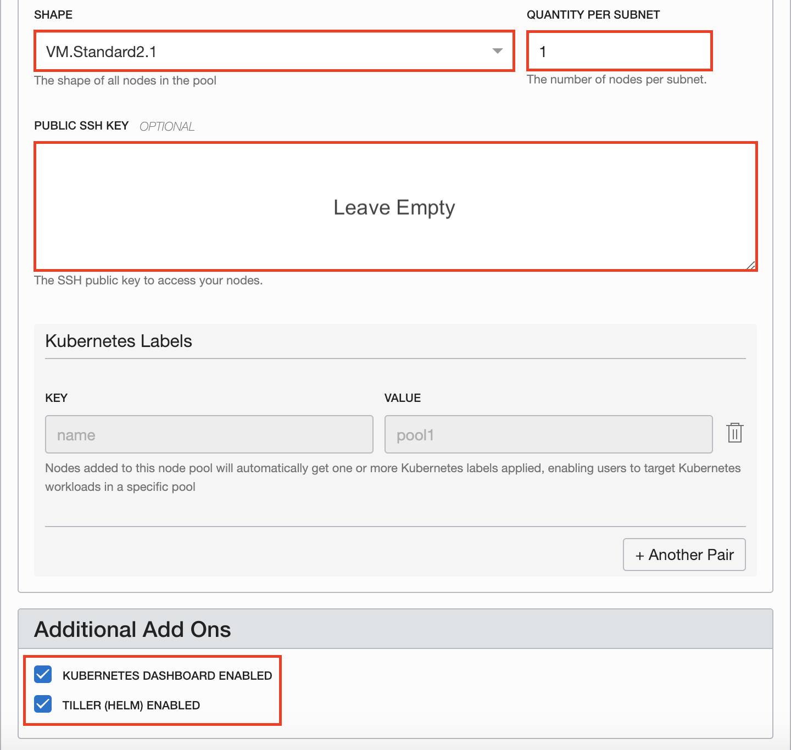
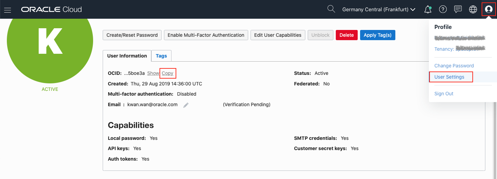
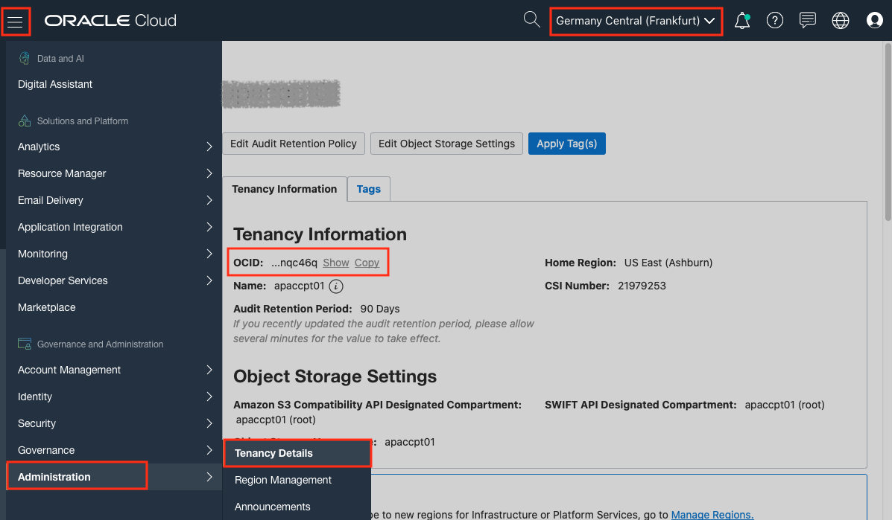
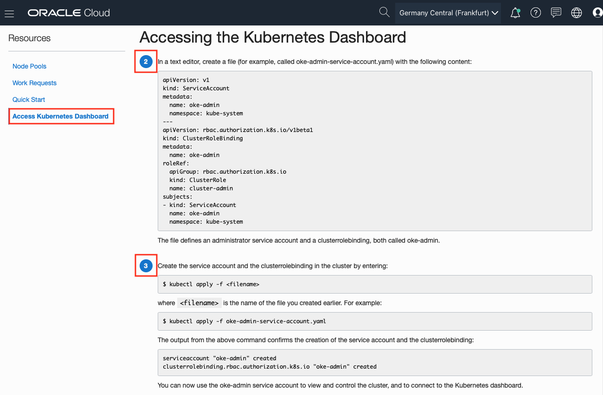
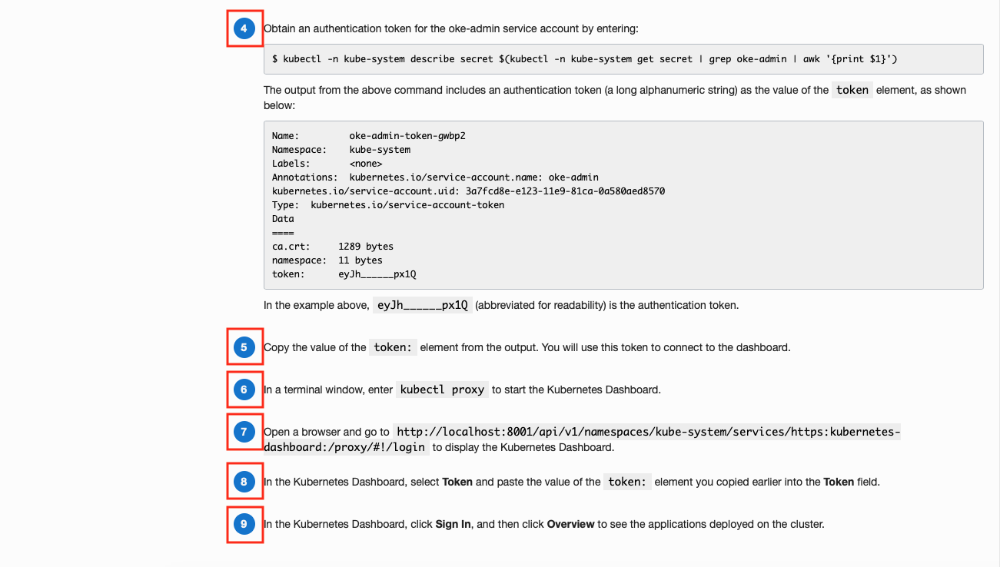

# Lab 0: Create Oracle Container Engine for Kubernetes (OKE) on Oracle Cloud Infrastructure (OCI) #

Oracle Cloud Infrastructure Container Engine for Kubernetes is a fully-managed, scalable, and highly available service that you can use to deploy your containerised applications to the cloud. Use Container Engine for Kubernetes (sometimes abbreviated to just OKE) when your development team wants to reliably build, deploy, and manage cloud-native applications. You specify the compute resources that your applications require, and Container Engine for Kubernetes provisions them on Oracle Cloud Infrastructure in an existing OCI tenancy.

### Prerequisites ###

[Oracle Cloud Infrastructure](https://cloud.oracle.com/en_US/cloud-infrastructure) enabled account.

To create Container Engine for Kubernetes (OKE) the following steps need to be completed:

- Create network resources (VCN, Subnets, Security lists, etc.)
- Create Cluster.
- Create NodePool.

This tutorial shows the simplest way the *Quick Start* feature creates and configures all the necessary resources for a 3 Kubernetes node cluster. All the nodes will be deployed in different Availability Domains to ensure high availability.

More information about OKE and custom cluster deployment:

- [Oracle Container Engine documentation](https://docs.cloud.oracle.com/iaas/Content/ContEng/Concepts/contengoverview.htm)

### Open the OCI console ###

If you have signed into your OCI console before, you can go straight to the [OCI console page](https://console.us-ashburn-1.oraclecloud.com/#/a/)

  - Enter your Cloud Tenant and click **Continue**

  

  - Click **Continue** in the left hand box to sign in with your SSO credentials

  

### Otherwise:

Sign in using your Cloud Services link you got in email during the registration process. (If this is the first time you have to change the generated first time password.)

Enter your username and password from your Trial Account sign up. Click **Sign In**.

Click the menu icon at the top left corner and select **Compute** on the left sliding menu.

You have to land on the OCI console page.

### Create Policy ###

A service policy allows OKE to create resources in tenancy such as compute. An OKE resource policy or policies enables you to regulate which groups in your tenancy can do what with the OKE API.

Optionally create more resource policies if you want to regulate which groups can access different parts of the OKE service.

Open the navigation menu. Under **Identity**, click **Policies**.

Select on left hand side menu a "root" compartment for your account (see screenshot). A list of the policies in the compartment you're viewing is displayed. If you want to attach the policy to a compartment other than the one you're viewing, select the desired compartment from the list on the left. Click **Create Policy**.

Enter the following:

- **Name:** A unique name for the policy. The name must be unique across all policies in your tenancy. You cannot change this later.
- **Description:** A friendly description.
- **Policy Versioning:** Select **Keep Policy Current**. It ensures that the policy stays current with any future changes to the service's definitions of verbs and resources.
- **Statement:** A policy statement. It MUST be: `allow service OKE to manage all-resources in tenancy`
- **Tags:** Don't apply tags.

Click **Create**.

### Create OKE (Oracle Container Engine for Kubernetes) cluster ###

*Quick Create* feature uses default settings to create a *quick cluster* with new network resources as required. This approach is the fastest way to create a new cluster. If you accept all the default values, you can create a new cluster in just a few clicks. New network resources for the cluster are created automatically, along with a node pool and three worker nodes.

In the Console, open the navigation menu. Under *Solutions, Platform and Edge*, go to *Developer Services* and click **Container Clusters (OKE)**.

On the Cluster List page, click **Create Cluster**.

Specify the following configuration details:

- **Name**: The name of the new cluster. For example the default *cluster1*
- **Kubernetes Version**: The Kubernetes version that runs on the master nodes and worker nodes of the cluster. Select the latest version.
- Select **Quick Create** to create a new cluster with default settings, along with new network resources for the new cluster.
The Create Virtual Cloud Network panel shows the network resources that will be created for you by default, namely a VCN, two load balancer subnets, and three worker node subnets.

	The Create Node Pool panel shows the fixed properties of the first node pool in the cluster that will be created for you:

	- the name of the node pool (always pool1)
	- the compartment in which the node pool will be created (always the same as the one in which the new network resources will reside)
	- the version of Kubernetes that will run on each worker node in the node pool (always the same as the version specified for the master nodes)
        - the image to use on each node in the node pool

The Create Node Pool panel also contains some node pool properties that you can change.
- **Shape**: The shape to use for each node in the node pool. The shape determines the number of CPUs and the amount of memory allocated to each node. The list shows only those shapes available in your tenancy that are supported by Container Engine for Kubernetes. Select the available *VM.Standard2.1*
- **Quantity per Subnet**: The number of worker nodes to create for the node pool in each subnet. Set *1*
- **Public SSH Key**: Leave this field empty (screenshot contains some key - but for simplicity leave this empty)
- **Kubernetes Dashboard Enabled**: leave the default true.
- **Tiller (Helm) Enabled**: leave the default true.

Click **Create** to create the new network resources and the new cluster.

Click **Close** to return to the Console.

### Prepare OCI CLI to download Kubernetes configuration file ###

When you create a cluster, you need to download a Kubernetes configuration file (commonly known as a `kubeconfig` file) for the cluster. **To do so you have to add OCI API Signing key and configure OCI CLI on your workstation (Virtualbox environment)**.

### Configure OCI CLI ###

Before using the CLI, you have to create a config file that contains the required credentials for working with Oracle Cloud Infrastructure. To have this config the CLI walks you through the first-time setup process, step by step, use the `oci setup config` command. The command prompts you for the information required for the config file and the API public/private keys. The setup dialog generates an API key pair and creates the config file.

Before you start the setup collect the necessary information using your OCI console.

- User OCID
- Tenancy OCID
- Region

In the Console click on your OCI user name and select User Settings. On the user details page you can find the *user OCID*. Click **Copy** and paste temporary to a text editor.

To identify *tenancy OCID* in the Console, open the navigation menu. Under *Governance and Administration*, go to *Administration* and click **Tenancy Details**. Click **Copy** to get tenancy OCID on clipboard. Paste to your text editor for OCI CLI configuration.

Leave the console open during CLI configuration and copy the required information from the console page or from text editor where you collected the OCIDs (user and tenancy). When you want to accept the default value what is offered in square bracket just hit Enter.

---

Note: If you need to install OCI CLI then follow the [documentation](https://docs.cloud.oracle.com/iaas/Content/API/SDKDocs/cliinstall.htm).

---

Execute oci setup config command to setup the CLI:

	$ oci setup config
	    This command provides a walkthrough of creating a valid CLI config file.

	    The following links explain where to find the information required by this
	    script:

	    User OCID and Tenancy OCID:

	        https://docs.us-phoenix-1.oraclecloud.com/Content/API/Concepts/apisigningkey.htm#Other

	    Region:

	        https://docs.us-phoenix-1.oraclecloud.com/Content/General/Concepts/regions.htm

	    General config documentation:

	        https://docs.us-phoenix-1.oraclecloud.com/Content/API/Concepts/sdkconfig.htm

	Enter a location for your config [/home/oracle/.oci/config]:

Enter to accept default directory location. Provide your user and tenancy OCIDs.

	Enter a user OCID: <YOUR_USER_OCID>
	Enter a tenancy OCID: <YOUR_TENANCY_OCID>

Enter your region. You can see in the console (browser) at the top right area. It has to be *eu-frankfurt-1*, if not type the proper region code.

	Enter a region (e.g. eu-frankfurt-1, uk-london-1, us-ashburn-1, us-phoenix-1): <YOUR_REGION>

Generate new API signing key. For the location accept default.

**Don't use a passphrase for the private key**. Just hit return for no passphrase.

	Do you want to generate a new RSA key pair? (If you decline you will be asked to supply the path to an existing key.) [Y/N]: Y

	Enter a directory for your keys to be created [/home/oracle/.oci]:
	Enter a name for your key [oci_api_key]:
	Public key written to: /home/oracle/.oci/oci_api_key_public.pem
	Enter a passphrase for your private key (empty for no passphrase):
	Private key written to: /home/oracle/.oci/oci_api_key.pem
	Fingerprint: 41:ea:cf:23:01:a2:bb:fb:84:79:34:8e:fe:bc:18:4f
	Config written to /home/oracle/.oci/config

### Upload the public key of the API signing key pair ###

The final step to complete the CLI setup to upload your freshly generated public key through the console. The public key if you haven't changed it during setup can be found in the `/home/oracle/.oci/` directory and it's name `oci_api_key_public.pem`. Using your favourite way copy its content to the clipboard. While viewing user details click **Add Public Key**.

Copy the content of the `oci_api_key_public.pem` file into the *PUBLIC KEY* text area and click **Add**.

The key is uploaded and its fingerprint is displayed in the list.

### Configuring kubectl ###

---

**Note**: If you are using the VirtualBox image, then `kubectl` is already installed. Otherwise, if you need to install `kubectl` then follow the [documentation](https://kubernetes.io/docs/tasks/tools/install-kubectl/).

---

The CLI setup now is done. To complete the `kubectl` configuration open the navigation menu and under **Developer Services**, click **Clusters**. Select your cluster and click to get the detail page.

Click **Access Kubernetes Dashboard** under **Resources** menu on the left.

Follow **Steps 1 to 9** to download the Kubeconfig file and the authentication token required for accessing the oke-admin service.

In **Step 1**, click **Access Kubeconfig**

A dialog pops up which contains the customized OCI command that you need to execute to create Kubernetes configuration file.

Copy and execute the commands on your desktop where OCI CLI was configured. For example:

	$ mkdir -p $HOME/.kube
	$ oci ce cluster create-kubeconfig --cluster-id ocid1.cluster.oc1.eu-frankfurt-1.aaaaaaaaaezwenlfgm4gkmzxha2tamtcgjqwmoldmu3tcnlfgc2tcyzzmrqw --file $HOME/.kube/config --region eu-frankfurt-1

Note! For `kubectl` try to use by defult `$HOME/.kube/config` configuration file. If you save it to a different location and use different filename, don't forget to set the `KUBECONFIG`  variable to the configuration file. E.g.:

	export KUBECONFIG=another_folder_path/kubernetes_config_file_name

Now check that `kubectl` is working, for example using the `get node` command:

	$ kubectl get node
	NAME            STATUS    ROLES     AGE       VERSION
	130.61.58.206   Ready     node      16m       v1.11.5
	130.61.60.127   Ready     node      16m       v1.11.5
	130.61.72.48    Ready     node      16m       v1.11.5

If you see the node's information the configuration was successful. Probably the Name column will contain the IPs that are non-routable

Complete the configuration by following **Steps 2 to 9**.

Once you have access to the Kubernetes Dashboard then you successfully configured `kubectl`.

Congratulation, now your OCI OKE environment is ready to deploy your WebLogic domain.

**You are now ready to move to the next lab: [Lab 1: Create Oracle Container Pipelines Application to Build Custom WebLogic Domain Image](build.weblogic.image.pipeline.md)**
